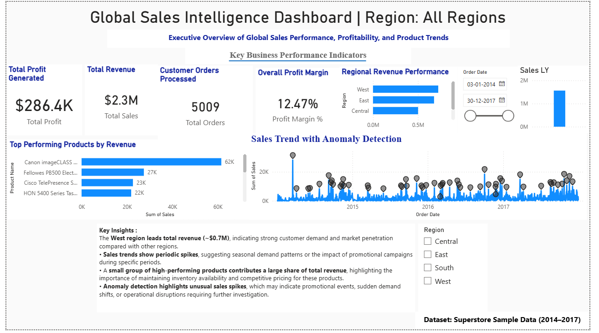

# Global Sales Intelligence Dashboard (Power BI)

## Project Overview

This project presents a Power BI dashboard analyzing global retail sales performance using the Superstore dataset.
The dashboard provides an executive overview of revenue, profitability, customer orders, and product performance across multiple regions.

The objective of this project is to demonstrate how business intelligence tools can transform raw sales data into meaningful insights for decision-making.

---

## Business Questions

This dashboard answers key business questions such as:

* Which regions generate the highest revenue?
* What is the overall profit margin?
* Which products contribute most to total sales?
* How do sales trends change over time?
* Are there unusual spikes or anomalies in sales activity?

---

## Key Insights

* The **West region leads total revenue (~$0.7M)**, indicating strong customer demand and market penetration compared with other regions.
* **Sales trends show periodic spikes**, suggesting seasonal demand patterns or the impact of promotional campaigns during certain periods.
* A **small group of high-performing products contributes a large share of total revenue**, highlighting the importance of maintaining inventory availability and competitive pricing.
* **Anomaly detection highlights unusual sales spikes**, which may indicate promotional events, sudden demand shifts, or operational disruptions.

---

## Tools Used

* Power BI
* DAX (Data Analysis Expressions)
* Data Visualization
* Business Intelligence Analytics

---

## Dataset

Superstore Sample Dataset (2014–2017)

---

## Dashboard Preview

---

## Skills Demonstrated

* Data Visualization
* Business Intelligence Reporting
* Trend Analysis
* Anomaly Detection
* Dashboard Design
* Data Storytelling
